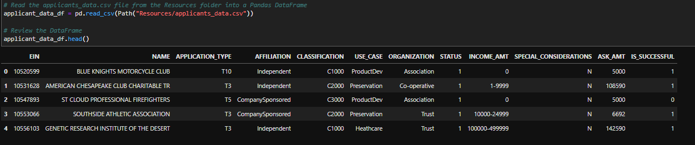
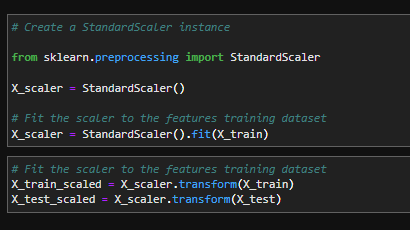
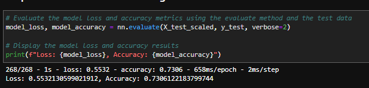

# Predicting Financial Risk Models with Neural Networks
This tool uses deep neural networks to create binary classifications models and predictions to analyze funding risks

<!-- TABLE OF CONTENTS -->

  
Table of Contents

  <ol>
    <li>
      <a href="#purpose">Purpose</a>
      <ul>
        <li><a href="#inputs">Inputs</a></li>
        <li><a href="#outputs">Outputs</a></li>
      </ul>
    </li>
    <li>
      <a href="#modeling_techniques">Modeling Techniques</a>
      <ul>
        <li><a href="#pandas">Pandas</a></li>
        <li><a href="#sklearn">sklearn</a></li>
        <li><a href="#standardscaler">Standard Scaler</a></li>
        <li><a href="#binary-crosscentropy">Binary Crosscentropy</a></li>
        <li><a href="#adam-optimizer">Adam Optimizer</a></li>
        <li><a href="#accuracy-evaluation">Accuracy Evaluation</a></li>
      </ul>
    </li>
    <li><a href="#version-release">Version Release</a></li>
    <li><a href="#how-to-run">How to run</a></li>
    <li><a href="#usage">Usage</a></li>
    <li><a href="#contributors">Contributors</a></li>
    <li><a href="#license">License</a></li>
        <ul>
        <li><a href="#permissions">Permissions</a></li>
        <li><a href="#disclaimer">Disclaimer</a></li>
        </ul>
    </li>
    <li><a href="#aknowledgements">Aknowledgements</a></li>

---

<!--Purpose -->
## Purpose
This tool employs Supervised Machine Learning to model and identify creditworthiness of borrowers.

### Inputs
The application reads a data set of 34000 organizations that have recieved funding over the years. The CSV file contains a variety of information about each business including weather or not it became successful. 
We'll use this data to predict weather a business will be successful. The financial institution will use this to decide upon lending to the business.

    applicants_data.csv
 
### Process:
1. Read historical business data in the CSV file.
2. Process data for Neural Network Modeling.
3. Compile and Evaluate a Binary Classification Model using a Nerural Network. 
4. Optimize the Neural Network Model using Tensorflow and Keras.
5. Define 2 deep neural network models from the original network model and 2 optimization attempts.
6. Obtain each model's Predictive Accuracy metrics. 
7. Predictive accuracy metrics will be saved as outputs that summarize each optimization attempt and model.

### Outputs:
1. HDF5 file named AlphabetSoup.h5 
File includes the initial model's data
2. AlphabetSoup_Model_1.h5
First attempt to evaluate the model using test data to determine the model's loss and accuracy.
3. AlphabetSoup_Model_2.h5
Second attempt to evaluate the model using test data to determine the model's loss and accuracy.

    
---
<!--Technologies -->
## Technologies
### Python:

    Phyton Version: **3.7.13**

## Libraries and Dependencies

### Pandas
[pandas](https://pandas.pydata.org/)

### Sklearn
[sklearn](https://scikit-learn.org/stable/)

### Standard Scaler
[standardscaler](https://scikit-learn.org/stable/modules/generated/sklearn.preprocessing.StandardScaler.html)

### Binary Crossentropy
[binary-crosscentropy](https://pythonguides.com/binary-cross-entropy-tensorflow/) 

### Adam optimizer
[adam-optimizer](https://pythonguides.com/adam-optimizer-pytorch/)

### Accuracy Evaluation Metric
[accuracy-evaluation](https://pythonguides.com/adam-optimizer-pytorch/)

---
<!--How to run -->
## How to run
1. Clone the repository on a folder that will easy to open
2. File can run on a Jupyter notebook or Google Colab
3. Open the file with Jupiter using the Anaconda Navigator
4. Navigate open the folder where the files were cloned to
5. Open the file on JupyterLab
ANACONDA - Navigator

6. Make sure to import and install the required libaries and dependencies: 

        Install the required Supervised Learning libraries
            conda activate dev
            from pathlib import Path

        Import the required libraries and dependencies
            import tensorflow as tf
            from tensorflow.keras.layers import Dense
            from tensorflow.keras.models import Sequential
            from sklearn.model_selection import train_test_split
            from sklearn.preprocessing import StandardScaler,OneHotEncoder

---
<!--Version Release -->
## Version Release

### Version 1.0

---
<!--Usage -->
## Usage

### Data: Lending data

### Applicant Data

### Standard Scaler:

### Model Evaluation:

### Alternative Models 1 and 2 results:

1[model1and2](./images/model1and2.png)

---
<!--Contributors -->
## Contributors

Jeremy Vargas

    Managing Director
    Resonant Solutions LLC
    email:    jeremyvargas@resonantsolutions.org
    linkedin: https://www.linkedin.com/in/jeremyvargas/

UW FinTech Bootcamp
- Startup code provided by institution

---
<!--License -->
## License
Tool is available under an MIT License.

Copyright (c) 2022 - Resonant Solutions, LLC

### Permissions
Permission is hereby granted, free of charge, to any person obtaining a copy of this software and associated documentation files (the “Software”), to deal in the Software without restriction, including without limitation the rights to use, copy, modify, merge, publish, distribute, sublicense, and/or sell copies of the Software, and to permit persons to whom the Software is furnished to do so, subject to the following conditions:

The above copyright notice and this permission notice shall be included in all copies or substantial portions of the Software.
### Disclaimer
The Software is provided “as is”, without warranty of any kind, express or implied, including but not limited to the warranties of merchantability, fitness for a particular purpose and noninfringement. In no event shall the authors or copyright holders be liable for any claim, damages or other liability, whether in an action of contract, tort or otherwise, arising from, out of or in connection with the software or the use or other dealings in the Software.

---
<!--Aknowledgements -->
## Aknowledgements
* [Markdown Guide](https://www.markdownguide.org/basic-syntax/#reference-style-links)

<!-- MARKDOWN LINKS & IMAGES -->
<!-- https://www.markdownguide.org/basic-syntax/#reference-style-links -->